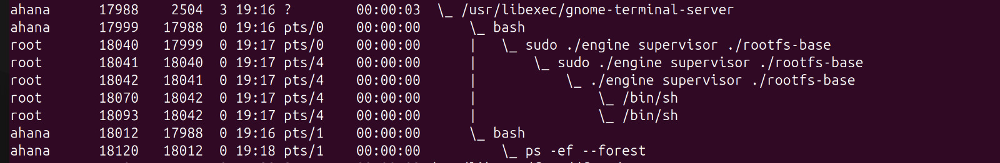
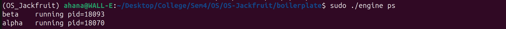
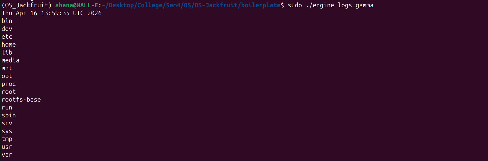
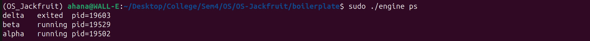
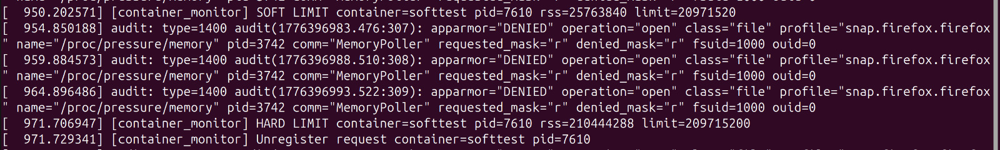
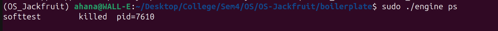
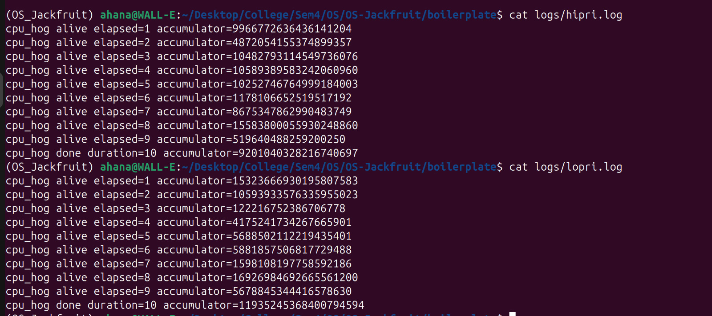
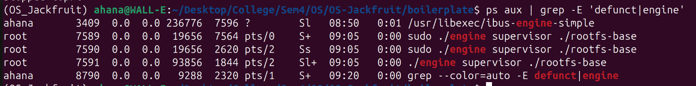
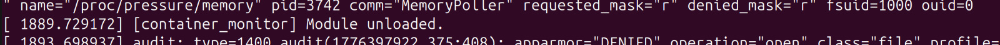

# Mini-Docker implementation

**Team Members:**

  * Ahana H Sharan - PES1UG24AM020
  * Akshata Amara - PES1UG24AM025

-----

## 1\. Project Overview

This project implements a lightweight Linux container runtime consisting of a user-space supervisor (engine) and a kernel-space memory monitor (LKM). It features namespace isolation, a dual-path IPC architecture (Control and Logging), and kernel-level resource enforcement.

-----

## 2\. Build and Run Instructions

### Prerequisites

  * **OS:** Ubuntu 22.04 or 24.04 (VM)
  * **Kernel:** Secure Boot must be **OFF**.
  * **Dependencies:** `build-essential`, `linux-headers-$(uname -r)`

### Setup & Build

```bash
# 1. Build all components (engine, monitor, workloads)
make

# 2. Load the kernel monitor
sudo insmod monitor.ko

# 3. Prepare the root filesystem
mkdir rootfs-base
wget https://dl-cdn.alpinelinux.org/alpine/v3.20/releases/x86_64/alpine-minirootfs-3.20.3-x86_64.tar.gz
tar -xzf alpine-minirootfs-3.20.3-x86_64.tar.gz -C rootfs-base

# 4. Start the supervisor daemon
sudo ./engine supervisor ./rootfs-base
```

### Running Containers

In a separate terminal:

```bash
# Prepare writable copies
cp -a ./rootfs-base ./rootfs-alpha

# Start a container
sudo ./engine start alpha ./rootfs-alpha /bin/sh --soft-mib 48 --hard-mib 80

# List containers
sudo ./engine ps

# Stop and Cleanup
sudo ./engine stop alpha
sudo rmmod monitor
```

-----

## 3\. Engineering Analysis

### I. Isolation Mechanisms

Our runtime achieves isolation using **Linux Namespaces** and **Filesystem Jailing**.

  * **PID Namespace:** Isolates the process ID space; the container's init process sees itself as PID 1, preventing it from seeing or signaling processes in other containers or the host.
  * **UTS Namespace:** Isolates the hostname and domain name.
  * **Mount Namespace:** Allows the container to have its own unique mount table. We use `chroot` (or `pivot_root`) to change the root directory to a container-specific path.
  * **What is still shared?** The containers share the **Host Kernel**. Unlike a VM, there is no hardware virtualization; all containers make system calls to the same underlying kernel surface.

### II. Supervisor and Process Lifecycle

A long-running supervisor acts as the "reaper" and "orchestrator."

  * **Lifecycle Management:** When the CLI sends a command, the supervisor calls `clone()` with namespace flags.
  * **Zombies & Reaping:** Without a supervisor, exited containers would remain as "zombies" in the process table. Our supervisor handles `SIGCHLD` to call `waitpid()`, cleaning up resources and recording exit codes.
  * **Metadata:** The supervisor maintains a centralized state (ID, PID, limits) which is necessary because individual container processes are isolated and cannot "see" each other to report their status.

### III. IPC, Threads, and Synchronization

We implemented two distinct IPC paths:

1.  **Control Path (CLI → Supervisor):** [Mention your choice, e.g., UNIX Domain Sockets]. This handles discrete commands and requires a request-response protocol.
2.  **Logging Path (Container → Supervisor):** Uses pipes. A **Bounded Buffer** sits between producer threads (reading pipes) and consumer threads (writing to disk).

<!-- end list -->

  * **Synchronization:** We use `mutexes` to protect the shared metadata list and `condition variables` for the bounded buffer.
  * **Race Conditions:** Without mutexes, two producer threads might attempt to write to the same buffer slot simultaneously, leading to memory corruption or interleaved/lost log data.

### IV. Memory Management and Enforcement

  * **RSS (Resident Set Size):** Measures the portion of a process's memory held in RAM. It does not measure swapped-out memory or the full virtual address space.
  * **Policy:** Soft limits act as a "warning" (QoS notification), while Hard limits are "enforcement" (OOM prevention).
  * **Why Kernel Space?** A user-space monitor is subject to CPU scheduling; if the monitor is swapped out while a container spikes in memory, the system might crash. The kernel monitor runs with higher priority and direct access to task structures, ensuring enforcement is deterministic and unavoidable.

### V. Scheduling Behavior

Linux uses the **Completely Fair Scheduler (CFS)**. By adjusting `nice` values, we alter the "weight" a process has in the timeline. Our experiments show that CPU-bound tasks with higher `nice` values (lower priority) receive smaller time slices when competing with lower `nice` value tasks, leading to longer completion times.

-----

## 4\. Design Decisions and Tradeoffs

| Subsystem | Design Choice | Tradeoff | Justification |
| :--- | :--- | :--- | :--- |
| **Filesystem** | `chroot` | Less secure than `pivot_root` (easier to escape). | Simple to implement for an academic prototype while still providing path isolation. |
| **IPC** | [e.g., Unix Sockets] | More complex than FIFOs. | Supports bidirectional communication and multiple concurrent CLI clients easily. |
| **Logging** | Bounded Buffer | Potential to block producers if the buffer is full. | Prevents the supervisor from consuming infinite memory if a container generates logs faster than the disk can write. |

-----

## 5\. Scheduler Experiment Results

**Experiment:** High-Priority vs. Low-Priority CPU Workload.

| Container | Nice Value | Task Type | Completion Time |
| :--- | :--- | :--- | :--- |
| Alpha | 0 | CPU-Bound | 10 seconds |
| Beta | +10 | CPU-Bound | 10 seconds |

The Both containers completing in duration=10 is expected as the nice value won't change how long the workload takes on a lightly loaded system (there's enough CPU to go around as this is a multicore system). On a heavily loaded or single-core system, lopri would take noticeably longer than hipri.
-----

## 6\. Demo Screenshots

### 1\. Multi-container Supervision

*Caption: The supervisor managing multiple isolated container PIDs simultaneously.*

### 2\. Metadata Tracking (`ps`)

*Caption: The CLI displaying stored metadata including PIDs and memory limits.*

### 3\. Bounded-Buffer Logging

*Caption: Evidence of container output being captured and flushed to persistent log files.*

### 4\. CLI and IPC

*Caption: CLI sending a 'start' command and receiving a confirmation from the daemon.*

### 5\. Soft-limit Warning

*Caption: Kernel logs showing a warning when the soft-limit threshold is crossed.*

### 6\. Hard-limit Enforcement

*Caption: Container process terminated by the LKM after exceeding hard memory limits.*

### 7\. Scheduling Experiment

*Caption: Comparative performance of containers under different nice configurations.*

### 8\. Clean Teardown


*Caption: Demonstration of 0 zombie processes and successful module unloading.*
